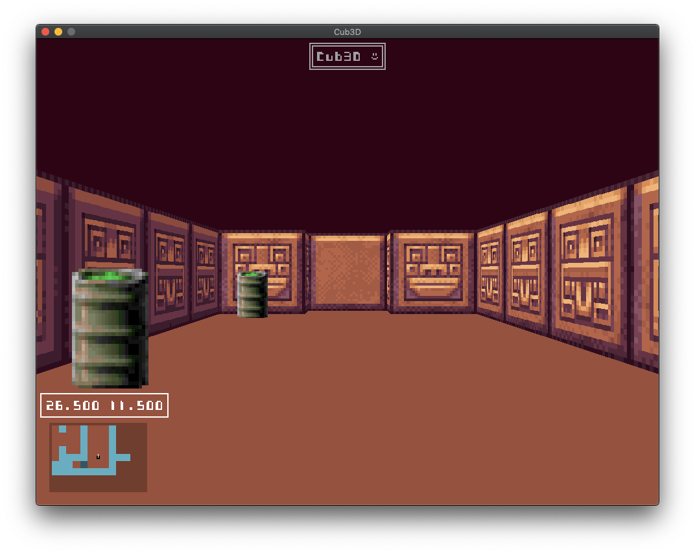
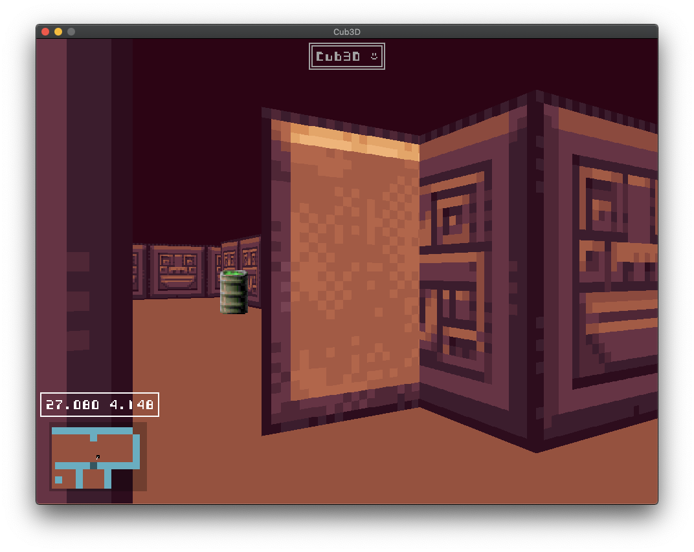
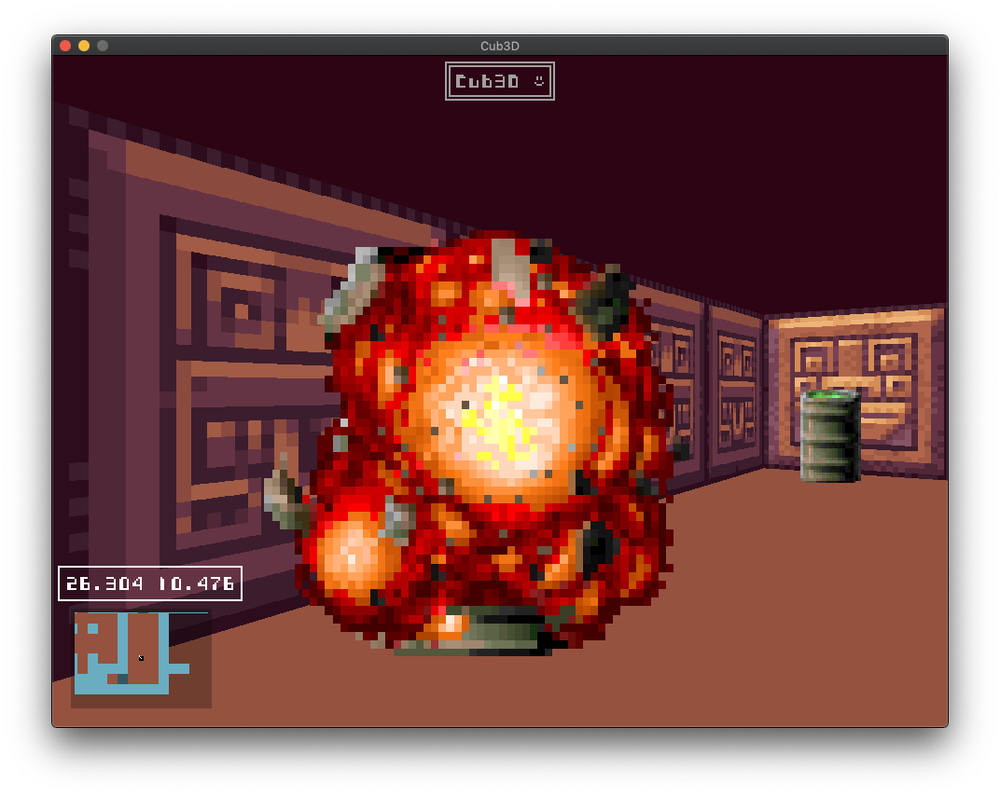

# cub3D

## What is this?
cub3D is a 42 common core project, which consists in coding our own little raycasting game from scratch. It is heavily inspired from the grandfather of the FPS genre, Wolfenstein 3D. It's also the first "big" graphical project of the 42 common core.

The only allowed library is 42's minilibX, a very basic and featureless API which only allows us to create windows, event loops, image buffers, and place said image-buffers on a window. Rest then assured that each pixel, in each frame, was placed with love and attention by my code. No hand holding.

I enjoyed this project a lot. Seeing my work take life, and being able to be interacted with, was quite gratifying. I eventually had to turn in the code to get to other projects, but had I had a few more weeks, I think I would have loved to implement a basic shooting & ennemies system, player bumping, or a portal systen, similar to [ttranche's exceptional cub3D](https://github.com/ttranche/cub3D).

cub3D allowed me to learn a lot more about basic graphical programming concepts, event loops, CPU cache optimization and CPU rendering limitations, DDA, raycasting, and more.

## Features in my cub3D include:
- Nice and smooth movement, with an acceleration/deceleration system, adjustable in headers.
- Mouse look which can be toggled on or off in-game
- An AABB hitbox collision system
- Wolfenstein 3D style half-depth, interactive doors
- Animated sprites, entirely configurable in the level file (*.cub)
- A custom bitmap font rendering system
- A minimap that adapts to the floor color
- Easy to understand parsing errors when an incorrect level file is given
- CPU cache optimization for wall textures
- Barrels that are so nice to hug :)

## Some screenshots

#### Doors can be opened and closed using the left mouse button:

#### Hugging a barrel triggers a small surprise:

###### P.S: Dear 42 students, I know I have pushed libft.a. It's because I want to keep my libft private but still allow other people to compile and link this project. Rest assured I didn't push the project like this when getting evaluated.
